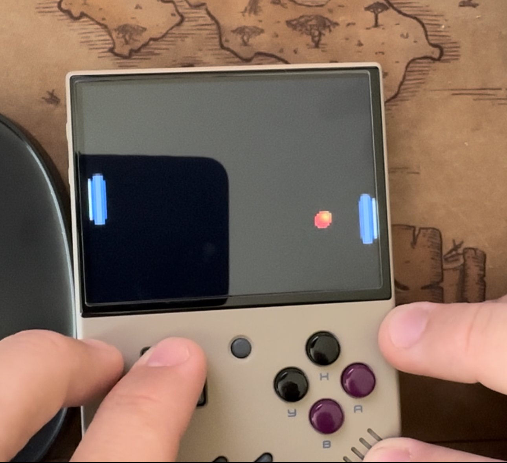

# AGBRS Pong

## A basic pong implementation

This takes what was started in the [official tutorial](https://agbrs.github.io/agb/pong/01_introduction.html) and finishes it out. It is far from perfect, but was my attempt at finishing it out. It's missing the animations for the ball that was included in [sprites.aseprite](gfx/sprites.aseprite), pretty sure there is not way to beat the AI since it just tracks the ball, and a bit of faulty collision logic. Used this as a fun project to learn simple game dev and to finally build something that can run on GBA emulators and hardware!



## Building

### Prerequisites

You will need the following installed in order to build and run this project:

- A recent version of `rustup`. See the [rust website](https://www.rust-lang.org/tools/install) for instructions for your operating system

You will also want to install an emulator. The best support in agb is with [mgba](https://mgba.io), with
`println!` support via `agb::println!` but any emulator should work. You'll get the best experience if
`mgba-qt` is in your `PATH`.

If you want to run your game on real hardware, you will also need to install `agb-gbafix` which you can do after installing
rust with the following: `cargo install agb-gbafix`. This is not required if you are only running your game in an emulator.

### Running in an emulator

Once you have the prerequisites installed, you should be able to build using

```sh
cargo build
```

or in release mode (recommended for the final version to ship to players)

```sh
cargo build --release
```

The resulting file will be in `target/thumbv4t-none-eabi/debug/agbrs_pong` or `target/thumbv4t-none-eabi/release/agbrs_pong` depending on
whether you did a release or debug build.

If you have `mgba-qt` in your path, you will be able to run your game with

```sh
cargo run
```

or in release mode

```sh
cargo run --release
```

## Starting development

You can find the documentation for agb [here](https://docs.rs/agb/latest/agb/).

You may also want to change the package name and version in `Cargo.toml` before you start.

## Shipping a .gba file for real hardware

To make a game run on real hardware, you will need to convert the built file into a file suitable for
running on the real thing.

First build the binary in release mode using the instructions above, then do the following:

```sh
agb-gbafix target/thumbv4t-none-eabi/release/agbrs_pong -o agbrs_pong.gba
```
